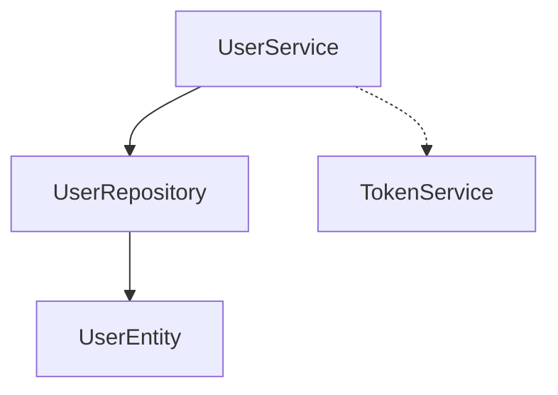

# Product Context

This file provides a high-level overview of the project and the expected product that will be created. Initially it is based upon projectBrief.md (if provided) and all other available project-related information in the working directory. This file is intended to be updated as the project evolves, and should be used to inform all other modes of the project's goals and context.
2025-06-09 11:37:36 - Log of updates made will be appended as footnotes to the end of this file.

-

## Project Goal

-

## Key Features

-

## Overall Architecture

-

## User Domain Design Overview

The user domain is structured into three main layers:

- **Entity Layer:** [`UserEntity`](src/domains/user/user.entity.ts:10) encapsulates user data and related logic.
- **Repository Layer:** [`userRepository`](src/domains/user/user.repository.ts:79) handles data persistence and retrieval using the entity.
- **Service Layer:** [`userService`](src/domains/user/user.service.ts:73) implements business logic and orchestrates repository operations.

### Flow Diagram

- [`UserService`](src/domains/user/user.service.ts:73) creates and manages users, and generates tokens via [`TokenService`](src/domains/token/token.service.ts).
- [`UserRepository`](src/domains/user/user.repository.ts:79) persists and retrieves user data, converting between models and entities.
- [`UserEntity`](src/domains/user/user.entity.ts:10) represents the user domain object.

_Last updated: 2025-06-09 11:41:34_
